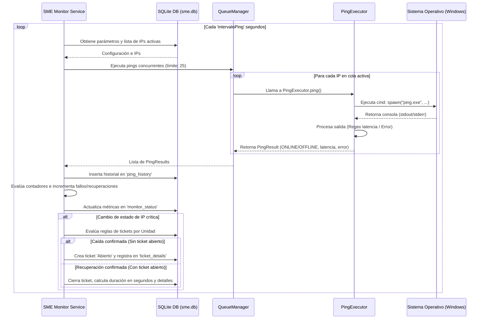
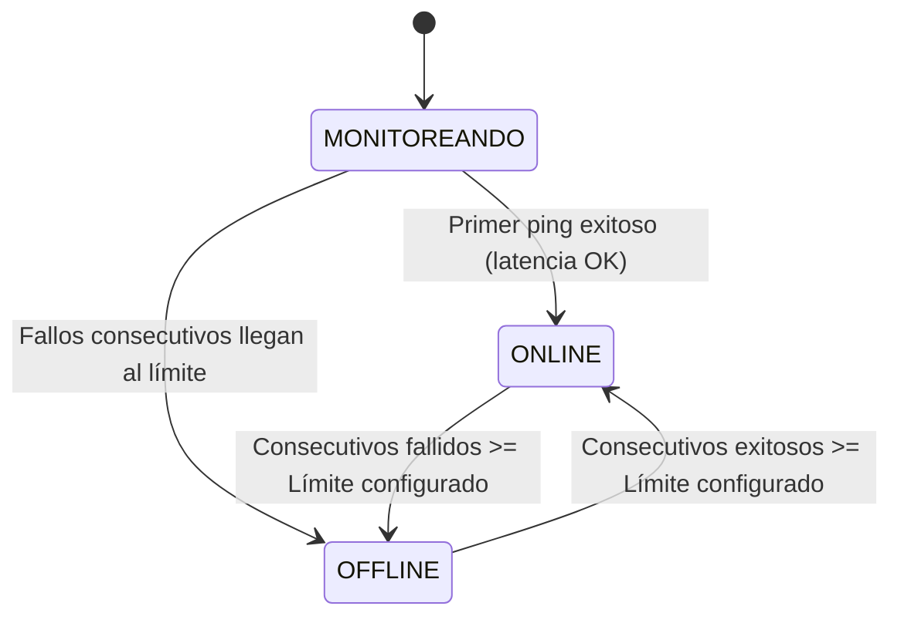

# Proceso y Mecanismo de Monitoreo de IPs (SME Monitor Service)

Este documento detalla el funcionamiento interno de **SME Monitor Service**, el proceso en segundo plano (Servicio de Windows) responsable del monitoreo automatizado de la infraestructura de red, la detección de fallas, la actualización de estados y la gestión autónoma del ciclo de vida de los incidentes (tickets).

---

## 1. Ciclo de Ejecución Principal

El motor opera en un ciclo infinito de ejecución asíncrona (`monitorCycle`). Cada iteración sigue el flujo descrito a continuación:



### Detalle de los Pasos:
1. **Lectura de Configuración Global**: En cada ciclo se consultan los parámetros de la tabla `settings`:
   * `intervaloPing`: Segundos de espera entre ciclos de monitoreo (defecto: 30s).
   * `fallosConsecutivos`: Umbral para declarar una IP como caída (defecto: 10).
   * `recuperacionesConsecutivas`: Umbral para declarar una IP como restablecida (defecto: 3).
   * `timeout`: Tiempo límite en milisegundos para esperar respuesta del ping (defecto: 1000ms).
2. **Carga de IPs Activas**: Se seleccionan de la base de datos las IPs donde `activa = 1` y la unidad asociada tiene `activo = 1`.
3. **Sincronización de Trackers en Memoria**: El servicio mantiene un mapa de estados y contadores en memoria (`trackers`) para calcular las transiciones de estado de cada IP en tiempo real sin saturar la base de datos con lecturas constantes de contadores de ciclos anteriores.

---

## 2. Gestión de Concurrencia (`QueueManager`)

Para evitar saturar la CPU y el subsistema de red del servidor al ejecutar cientos de pings al mismo tiempo, el sistema implementa una cola de control de concurrencia activa dentro de [QueueManager.ts](file:///c:/Users/israel.diaz/Desktop/MOBILE%20APP%20IMSS/Sistema%20de%20Monitoreo%20de%20Enlaces/monitor-service/src/services/QueueManager.ts):

*   **Límite de Concurrencia**: Establecido en un máximo de **25 ejecuciones en paralelo** (`maxConcurrency`).
*   **Algoritmo de Hilos de Trabajo (Workers)**: Se despliega un número de "trabajadores" asíncronos igual al menor entre el número de IPs activas y el límite de concurrencia. Cada trabajador extrae una IP de la lista secuencialmente, ejecuta el ping, escribe el resultado en el arreglo correspondiente y toma la siguiente IP hasta vaciar la cola.
*   **Aislamiento de Errores**: Si la ejecución de un comando de ping falla catastróficamente o arroja una excepción de sistema operativo, la cola captura el error y registra a esa IP individual como `OFFLINE` sin interrumpir al resto de los pings concurrentes.

---

## 3. Ejecución y Análisis del Ping (`PingExecutor`)

El servicio utiliza el binario nativo del sistema operativo Windows (`ping.exe`) a través de un proceso hijo seguro (`child_process.spawn`) para prescindir del uso de sockets crudos (raw sockets) que requerirían privilegios de Administrador.

El código se implementa en [PingExecutor.ts](file:///c:/Users/israel.diaz/Desktop/MOBILE%20APP%20IMSS/Sistema%20de%20Monitoreo%20de%20Enlaces/monitor-service/src/services/PingExecutor.ts):

### Comando Ejecutado
```bash
ping.exe -n 1 -w <timeoutMs> <ip>
```
*   `-n 1`: Realiza únicamente un (1) intento de transmisión de paquete ICMP.
*   `-w <timeoutMs>`: Milisegundos que espera respuesta antes de descartar el paquete.

### Procesamiento de la Salida (Consola)
*   **Codificación**: La salida del comando se lee en formato `latin1` para interpretar correctamente caracteres especiales y acentos en español (ej. "tiempo", "agotado", "inalcanzable").
*   **Validación de Éxito**: Se realiza una búsqueda por expresiones regulares para extraer la latencia:
    ```typescript
    const latencyMatch = stdoutData.match(/(?:tiempo|time)(?:=|<)(\d+)ms/i);
    ```
    Si el patrón coincide, el estado es **ONLINE** y se guarda la latencia en milisegundos (si la latencia devuelta es 0ms, se registra como 1ms como medida preventiva de consistencia).

*   **Clasificación de Errores (OFFLINE)**:
    Si la expresión regular no encuentra coincidencia de latencia, se analiza el texto para determinar la causa y guardar el diagnóstico preciso en `mensajeError`:

| Patrón Detectado | Estado Guardado | Mensaje Registrado (`mensajeError`) |
| :--- | :--- | :--- |
| `"espera agotado"` o `"timed out"` | `OFFLINE` | `"Timeout"` |
| `"inaccesible"` o `"unreachable"` | `OFFLINE` | `"Host inaccesible"` |
| `"desconocido"` o `"unknown"` | `OFFLINE` | `"Destino desconocido"` |
| Contiene `"perdid"`, `"lost"`, `"error"` o `"fallo"` | `OFFLINE` | Extrae la línea de error específica de la consola |
| Ninguno de los anteriores | `OFFLINE` | `"Falla de comunicación"` |

---

## 4. Máquina de Estados de una IP (`IpTracker`)

Cada IP monitoreada cambia de estado de forma lógica mediante los contadores en memoria. Esto evita que una caída momentánea (como un microcorte o pérdida de un paquete aislado) genere falsas alarmas o tickets innecesarios.



*   **Estado Inicial**: Al iniciar el servicio, la IP está en estado `MONITOREANDO`.
*   **Confirmación de Caída**:
    *   Si el ping resulta en `OFFLINE`, se reinicia el contador de recuperaciones a 0 y se incrementa el contador `consecutiveFailures`.
    *   Cuando `consecutiveFailures` alcanza exactamente el valor de `fallosConsecutivos` de la IP o el valor global de la configuración (ej. 10 fallos seguidos), la IP cambia oficialmente a estado `OFFLINE` y se registra un evento de tipo `Caída Enlace` en los logs.
*   **Confirmación de Recuperación**:
    *   Si el ping resulta en `ONLINE`, se reinicia el contador de fallos a 0 y se incrementa `consecutiveRecoveries`.
    *   Cuando `consecutiveRecoveries` alcanza exactamente el valor de `recuperacionesConsecutivas` (ej. 3 pings seguidos exitosos), la IP cambia a estado `ONLINE` y se registra un evento de tipo `Recuperación Enlace`.

---

## 5. Reglas de Generación de Tickets automáticos

Una vez que se evalúa el estado de las IPs en cada ciclo, se analizan las reglas de generación de tickets asociadas a cada Unidad.

*   **Identificación de IPs Críticas**:
    Solo las IPs configuradas con el flag `esCritica = 1` participan en la lógica de tickets de la Unidad. Las IPs no críticas registran su historial de pings de forma independiente y muestran su estado en pantalla, pero **no** abren ni cierran tickets.
*   **Lógica de Evaluación (Modo por Defecto - Cualquier IP Crítica)**:
    *   Se determina el estado de todas las IPs críticas de la Unidad.
    *   Si al menos una (1) IP crítica entra en estado `OFFLINE`, la unidad se considera en falla.
    *   **Apertura de Ticket**: Si la unidad está en falla y no hay ningún ticket abierto para esta unidad en la base de datos, el servicio genera un ticket con estado `'Abierto'`, autogenera un folio secuencial (ej. `SME-20260707-000001`) y registra los detalles en la tabla `ticket_details` ligando la(s) IP(s) causante(s).
    *   **Cierre de Ticket**: Si todas las IPs críticas de la unidad retornan a estado `ONLINE` y existe un ticket abierto de la unidad, el servicio actualiza el ticket a estado `'Cerrado'`, registra la fecha y hora final de restauración, guarda los comentarios automáticos y calcula la duración del incidente guardando el valor numérico en segundos (`duracionSegundos`).

---

## 6. Persistencia e Historial

Todos los resultados se persisten de forma transaccional en SQLite:
*   En cada ping de cada IP se inserta un registro en la tabla `ping_history` que almacena `ipId`, `fechaHora`, `resultado`, `latencia` (si aplica) y `mensajeError`.
*   **Depuración Automática**: Para evitar el crecimiento desmedido de la base de datos SQLite y mantener el rendimiento óptimo, si la configuración `actualizacionAutomatica` está habilitada en `settings`, el servicio ejecuta una rutina en cada ciclo que elimina de forma permanente del historial todos los pings con antigüedad mayor a 30 días (`fechaHora < límite`).
